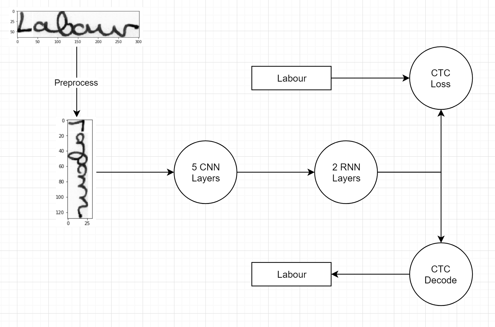
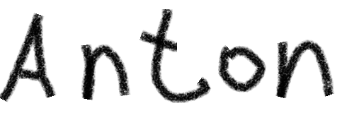
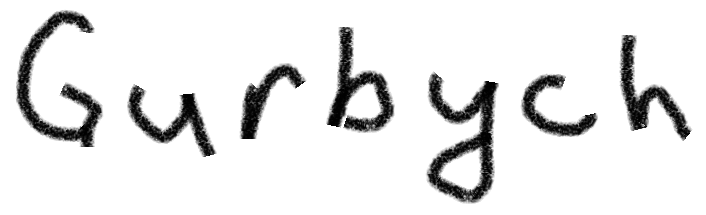
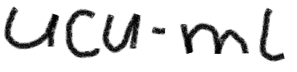

# Handwriting recognition

This project is created to recognize handwritten words based on [IAM database](http://www.fki.inf.unibe.ch/databases/iam-handwriting-database). 

## Project structure
```
handwritting-recognition
│   README.md
|   requirements.txt
└───/model - folder with pretrained model
|   |   checkpoint
|   |   snapshot-18.data-00000-of-00001
|   |   snapshot-18.index
|   |   snapshot-18.meta
|
└───/test - test dataset
|   |   test1.png
|   |   ...
|
|   main.py
│   layers.py - implementation of CNN, RNN and CTC layers
│   model.py - model implementation
|   predict.py - prediction of own handwriting
│   preprocess.py - input image preprocessing
│   structure.py - collecting dataset
```

## Getting Started

You should have Python and Pip installed.

```
pip install -r requirements.txt
```

```
python main.py
```

This will download the dataset automatically, create directory structure and train the model.

#### Training

Accuracy after first and last epoch:

    Epoch: 1
    Character error rate: 62.932467%. Word accuracy: 23.824354%.
    ...
    Epoch: 28
    Character error rate: 8.800423%. Word accuracy: 77.172220%.

After 28 epoches, we reached `77%` word accuracy and `8.8%` character error rate, and stopped training, as 4 consecutive epochs did not lower error rate.

There is pretrained model in `/model` folder. If you want to retrain model or train it with your dataset - clear `/model` folder.

## Pipeline


The architecture:
1) convolutional layers, which extract features from the input image;
2) recurrent layers, which predict a label distribution for each frame;
3) transcription layer, which translates the per-frame predictions into the final label sequence.


## Predicting results
To predict custom handwriting run

    python predict.py <path1> [path2] [path_n]
You should specify at least one image path. Example of usage:

    >python predict.py test/test1.png test/test2.png test/test3.png

    Your predictions are:
    test/test1.png : Anton
    test/test2.png : Gurbych
    test/test3.png : ucu-mL

| Image |  |  |  |
| :---: | :---: | :---: | :---: |
| Predicted label | Anton | Gurbych | ucu-mL


## Authors

* **[Mykhailo Poliakov](https://github.com/mxpoliakov)** 
* **[Anton Borkivskyi](https://github.com/AntonBorkivskyi)**
* **[Bohdan Borkivskyi](https://github.com/BohdanBorkivskyi)**

## Acknowledgments

[Build a Handwritten Text Recognition System using TensorFlow by Harold Scheidl](https://towardsdatascience.com/build-a-handwritten-text-recognition-system-using-tensorflow-2326a3487cd5)

[An End-to-End Trainable Neural Network for Image-based Sequence
Recognition and Its Application to Scene Text Recognition
](https://arxiv.org/pdf/1507.05717.pdf)
